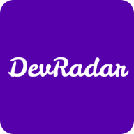
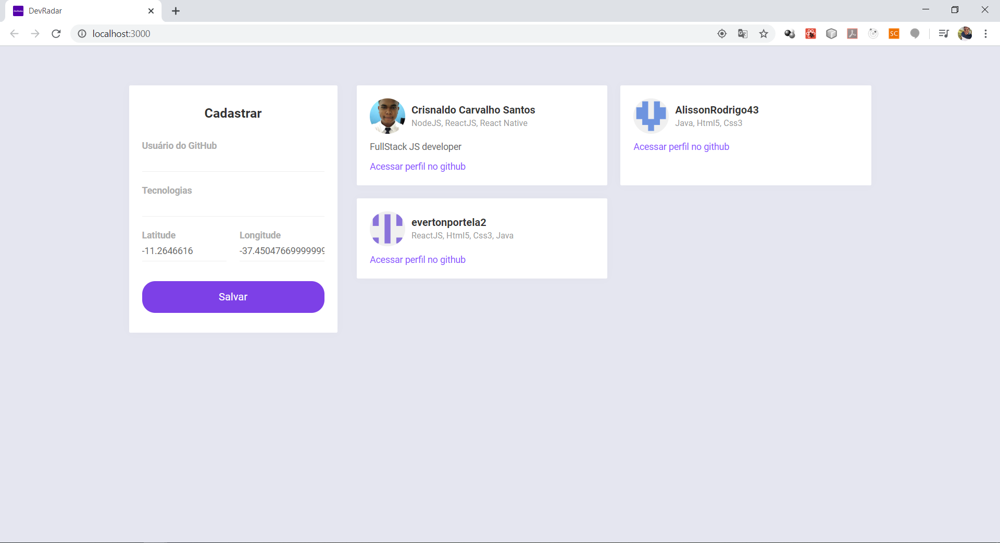
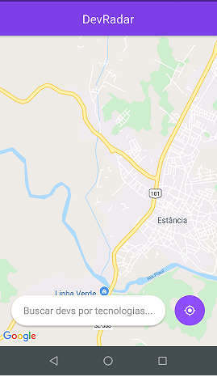
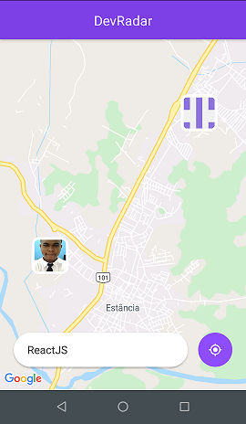
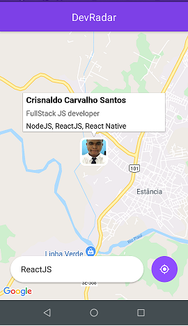
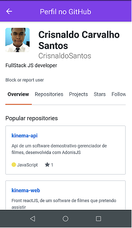

<h1 align="center">
    
     DevRadar
</h1>

  

  

  

  

## Descrição:

Aplicação full stack com Node, React e React Native desenvolvida durante a semana Omnistack 10.0 da rocketseat. O desafio foi desenvolver o "DevRadar", que visa conectar desenvolvedores próximos a você que trabalham com as mesmas tecnologias.

A aplicação web é responsável por cadastrar desenvolvedores, importando dados do Github e utilizando informações de latitude e longitude dos browser do usuário e inserindo as tecnologias qual o mesmo trabalha.

A aplicação mobile é para a exibição no mapa dos desenvolvedores que tem afinidade com as tecnologias preenchidas no campo de busca e que estejam em um raio de 10km do usuário que faz a pesquisa. 

## Secreenshots:

### Aplicação Web:

### Aplicação Mobile:

## Licença:

Esse projeto está sob a licença MIT. Veja o arquivo [LICENSE](LICENSE.md) para mais detalhes.

---

Feito com ♥ by Crisnaldo Carvalho in Estância/SE